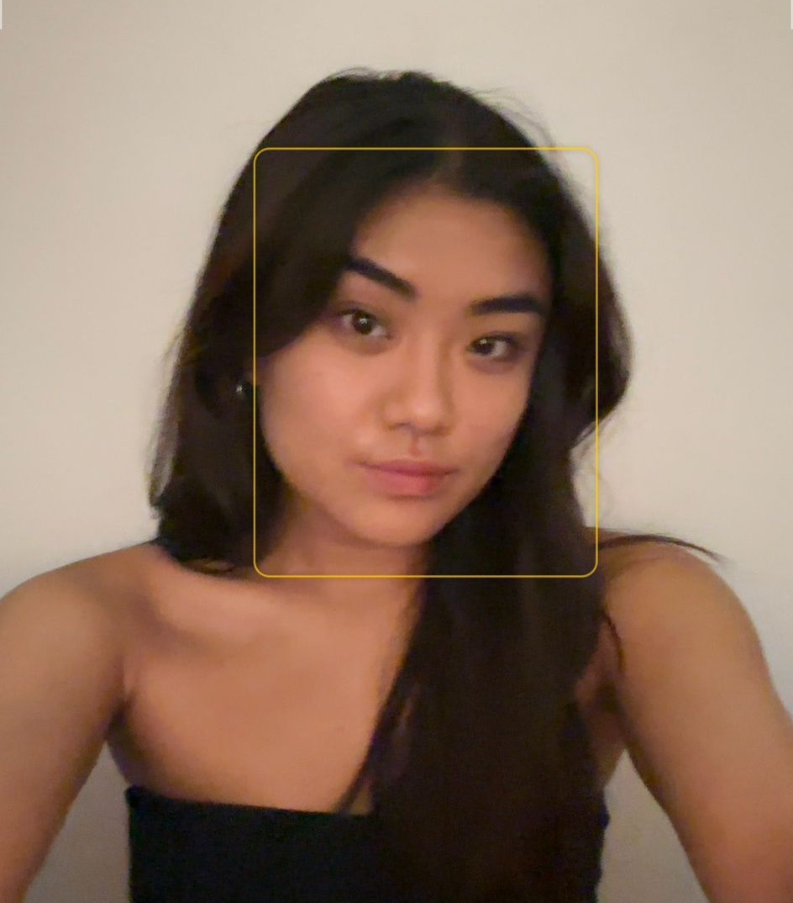

## Hello! I'm Katelyn 👋

  
  

    <h3>About Me</h3>
    
I'm a passionate developer who loves creating innovative solutions and learning new technologies. Welcome to my GitHub profile!

  

### 🔧 Technologies & Tools
- **Languages:** Python, JavaScript, .NET
- **Frontend:** React, HTML/CSS, Bootstrap
- **Backend:** Node.js, Firebase
- **Databases:** Postman
- **Tools:** Git, VS Code, Figma

### 📈 GitHub Stats

### 🚀 Featured Projects
- **Dissertation**: Automated Manual Super/Moderator Allocation System
- **EcoTracker**: Environmental impact tracking application

### 📫 How to Reach Me
- 💼 LinkedIn: [www.linkedin.com/in/katelyn-lai1]

### ⚡ Fun Facts
- 🧁 I love baking 
- 🏃‍♀️ Running enthusiast (I secretly hate it) 
- 🎨 Painting is my creative outlet 

